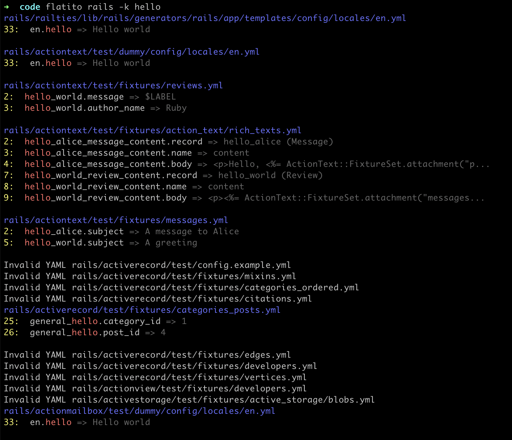

# Flatito: Grep for YAML and JSON files

A kind of grep for YAML and JSON files. It allows you to search for a key and get the value and the line number where it is located.



## Meaning

[Esperanto](https://en.wiktionary.org/wiki/flatito): singular past nominal passive participle of flati ('to flatter').

## Installation

Install the gem and add to the application's Gemfile by executing:

    $ bundle add flatito

If bundler is not being used to manage dependencies, install the gem by executing:

    $ gem install flatito

## Usage

```sh
Usage:    flatito PATH [options]
Example:  flatito . -k "search string" -e "json,yaml"
Example:  cat file.yaml | flatito -k "search string"

    -h, --help                       Prints this help
    -V, --version                    Show version
    -k, --search-key=SEARCH          Search string
        --no-color                   Disable color output
    -e, --extensions=EXTENSIONS      File extensions to search, separated by comma, default: (json,yaml,yaml)
        --no-skipping                Do not skip hidden files
```

## Development

After checking out the repo, run `bin/setup` to install dependencies. Then, run `rake test` to run the tests. You can also run `bin/console` for an interactive prompt that will allow you to experiment.

To install this gem onto your local machine, run `bundle exec rake install`. To release a new version, update the version number in `version.rb`, and then run `bundle exec rake release`, which will create a git tag for the version, push git commits and the created tag, and push the `.gem` file to [rubygems.org](https://rubygems.org).

## Contributing

Bug reports and pull requests are welcome on GitHub at https://github.com/ceritium/flatito. This project is intended to be a safe, welcoming space for collaboration, and contributors are expected to adhere to the [code of conduct](https://github.com/ceritium/flatito/blob/master/CODE_OF_CONDUCT.md).

## License

The gem is available as open source under the terms of the [MIT License](https://opensource.org/licenses/MIT).

## Code of Conduct

Everyone interacting in the Flatito project's codebases, issue trackers, chat rooms and mailing lists is expected to follow the [code of conduct](https://github.com/ceritium/flatito/blob/master/CODE_OF_CONDUCT.md).
