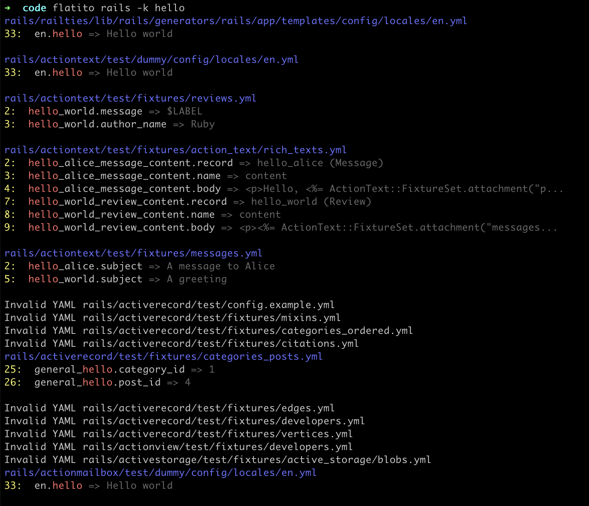

# Flatito: Grep for YAML and JSON files

A kind of grep for YAML and JSON files. It allows you to search by key or value and get the matching entries with their line numbers.



## Meaning

[Esperanto](https://en.wiktionary.org/wiki/flatito): singular past nominal passive participle of flati ('to flatter').

## Installation

Install the gem and add to the application's Gemfile by executing:

    $ bundle add flatito

If bundler is not being used to manage dependencies, install the gem by executing:

    $ gem install flatito

### Nixpkgs package

It is also available as [nixpkgs](https://search.nixos.org/packages?channel=unstable&show=flatito) thanks to [@Rucadi](https://github.com/Rucadi)

    $ nix run nixpkgs#flatito


## Usage

```sh
Usage:    flatito PATH [options]
Example:  flatito . -k "search string" -e "json,yaml"
Example:  flatito . -c "search value"
Example:  cat file.yaml | flatito -k "search string"
Example:  git diff | flatito -k "search string"

    -h, --help                       Prints this help
    -V, --version                    Show version
    -k, --search-key=SEARCH          Search by key
    -c, --search-value=SEARCH        Search by value
    -s, --case-sensitive             Case sensitive search
        --no-color                   Disable color output
    -e, --extensions=EXTENSIONS      File extensions to search, separated by comma, default: (json,yaml,yaml)
        --no-skipping                Do not skip hidden files
        --no-gitignore               Do not respect .gitignore
        --side=SIDE                  When input is a diff: before, after, or both (default: both)
```

Searches are case-insensitive by default. Use `-s` to force exact case matching.

Both `-k` and `-c` support regular expressions and can be combined:

```sh
# Find keys matching "database" with values containing "production"
flatito . -k "database" -c "production"
```

### Searching inside a `git diff`

When the input piped through stdin is a unified diff (e.g. the output of `git diff`),
flatito reports only the YAML/JSON entries whose lines were added (`+`) or
removed (`-`) by the diff. Each result is prefixed accordingly.

```sh
# Show every changed key in the working tree
git diff | flatito

# Inspect a specific commit, branch range, or staged changes
git diff HEAD~1 | flatito -k "version"
git diff main..feature | flatito -c "production"
git diff --cached | flatito

# Pick a side: only what was added, only what was removed, or both
git diff | flatito --side=after
git diff | flatito --side=before
```

When the diff includes git index hashes (the default for `git diff`), flatito
reads the original content via `git cat-file` so nested keys retain their
parent context. If those blobs are unavailable, it falls back to reconstructing
the changed regions from the diff hunks alone.

## Development

After checking out the repo, run `bin/setup` to install dependencies. Then, run `rake test` to run the tests. You can also run `bin/console` for an interactive prompt that will allow you to experiment.

To install this gem onto your local machine, run `bundle exec rake install`. To release a new version, update the version number in `version.rb`, and then run `bundle exec rake release`, which will create a git tag for the version, push git commits and the created tag, and push the `.gem` file to [rubygems.org](https://rubygems.org).

## Contributing

Bug reports and pull requests are welcome on GitHub at https://github.com/ceritium/flatito. This project is intended to be a safe, welcoming space for collaboration, and contributors are expected to adhere to the [code of conduct](https://github.com/ceritium/flatito/blob/master/CODE_OF_CONDUCT.md).

## License

The gem is available as open source under the terms of the [MIT License](https://opensource.org/licenses/MIT).

## Code of Conduct

Everyone interacting in the Flatito project's codebases, issue trackers, chat rooms and mailing lists is expected to follow the [code of conduct](https://github.com/ceritium/flatito/blob/master/CODE_OF_CONDUCT.md).
